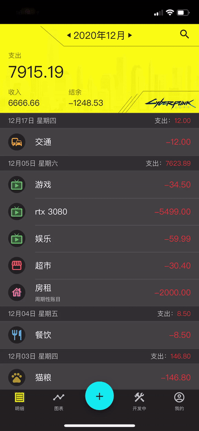
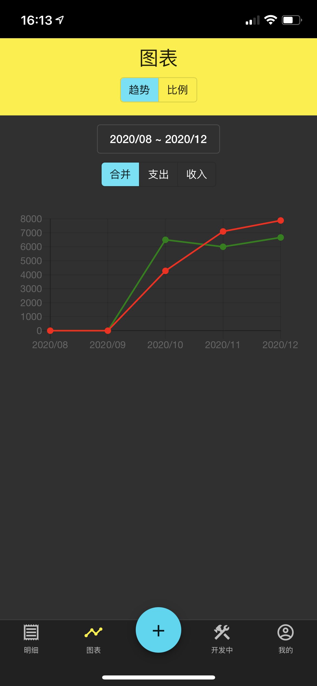
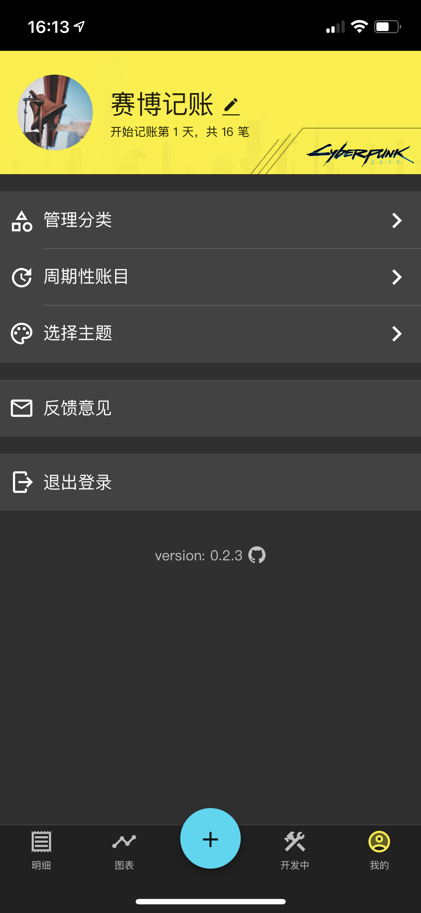
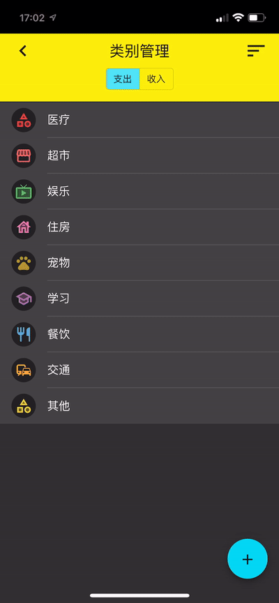

# 赛博记账 Cyberbook

A mobile-first web app that can record daily costs.

# Screenshots

## Transactons

<table>
  <tr>
    <td>Transaction List</td>
     <td>Edit Transaction</td>
     <td>Add Transaction</td>
  </tr>
  <tr>
    <td></td>
    <td></td>
    <td></td>
  </tr>
 </table>

## Charts

<table>
  <tr>
    <td>Line Chart</td>
     <td>Pie Chart</td>
  </tr>
  <tr>
    <td></td>
    <td></td>
  </tr>
 </table>

## Category

<table>
  <tr>
    <td>Add Category</td>
    <td>Sort Category</td>
  </tr>
  <tr>
    <td></td>
    <td></td>
  </tr>
 </table>

## User Home

<table>
  <tr>
    <td>Account Overview</td>
    <td>Register</td>
    <td>Login</td>
  </tr>
  <tr>
    <td></td>
    <td></td>
    <td></td>
  </tr>
 </table>

## Other

<table>
  <tr>
    <td>Swipe to Delete Transaction</td>
    <td>Swipe to Delete Category</td>
    <td>Select Theme</td>
  </tr>
  <tr>
    <td></td>
    <td></td>
    <td></td>
  </tr>
 </table>

# Features

## Existing Features

- [x] Mobile first responsive
- [x] Add record
- [x] Edit record
- [x] Record category
- [x] Show month summary
- [x] Select month
- [x] Pie chart
- [x] Line chart
- [x] Choose a month in pie chart
- [x] Choose date range in line chart
- [x] Auto register temp user
- [x] Register the temp user account
- [x] Login with existing account
- [x] Swipe to delete a transaction/category
- [x] Theme, and dark theme
- [x] Add/Edit category
- [x] Drag to sort categories
- [x] 订阅管理/周期性账目(工资，订阅，房租等)
- [x] Deploy

## TODOs

- [ ] User profile image
- [ ] Category icon
- [ ] Search
- [ ] Offline editing
- [ ] UI design
- [ ] Theme color design
- [ ] Animation (WIP)
- [ ] 站内信（意见反馈及回复）
- [ ] PWA
    - [ ] 提醒更新
    - [ ] 提醒安装
- [ ] 每次打开时会先显示默认主题
- [ ] 研究hammerjs的swipe
- [ ] 导出excel
- [ ] i18n
- [ ] 导航后退键提醒保存：
    - [ ] 用户信息编辑
    - [ ] 主题选择
    - [ ] 排序管理
- [ ] 禁止后退
    - [ ] 登录页面
