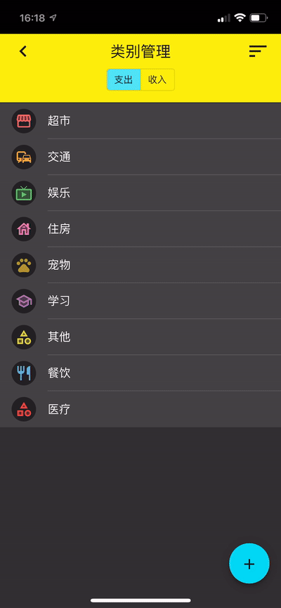
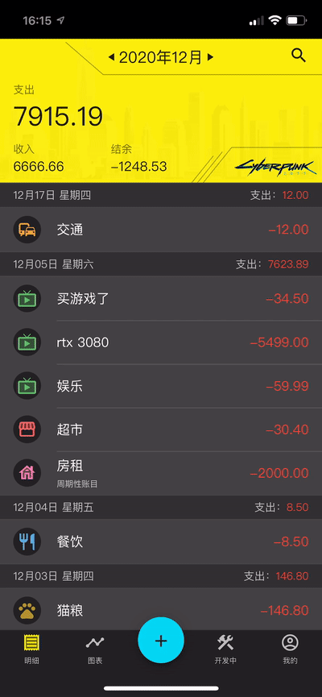

# 赛博记账 Cyberbook 

A mobile-first web app to keep track of daily spend.

[Try here](https://www.cyberbook.app)

# Screenshots

## Transactions

<table>
  <tr>
    <td>Transaction List</td>
    <td>Edit Transaction</td>
    <td>Add Transaction</td>
  </tr>
  <tr>
    <td></td>
    <td></td>
    <td></td>
  </tr>
 </table>

## Charts

<table>
  <tr>
    <td>Line Chart</td>
     <td>Pie Chart</td>
  </tr>
  <tr>
    <td></td>
    <td></td>
  </tr>
 </table>

## Category

<table>
  <tr>
    <td>Add Category</td>
    <td>Sort Category</td>
  </tr>
  <tr>
    <td></td>
    <td></td>
  </tr>
 </table>

## Subscription

<table>
  <tr>
    <td>Add Subscription</td>
    <td>Stop Subscription</td>
  </tr>
  <tr>
    <td></td>
    <td></td>
  </tr>
 </table>

## User Home

<table>
  <tr>
    <td>Account Overview</td>
    <td>Register</td>
    <td>Login</td>
  </tr>
  <tr>
    <td></td>
    <td></td>
    <td></td>
  </tr>
 </table>

## Other

<table>
  <tr>
    <td>Swipe to Delete Transaction</td>
    <td>Swipe to Delete Category</td>
    <td>Select Theme</td>
  </tr>
  <tr>
    <td></td>
    <td></td>
    <td></td>
  </tr>
 </table>

# Features

## Existing Features

- [x] Mobile first responsive
- [x] PWA
- [x] Add transaction
- [x] Edit transaction
- [x] Category management
- [x] Drag to sort categories
- [x] Show month summary
- [x] Select month
- [x] Pie chart
- [x] Line chart
- [x] Choose a month in pie chart
- [x] Choose date range in line chart
- [x] Auto register temp user
- [x] Register the temp user account
- [x] Login with existing account
- [x] Swipe to delete a transaction/category
- [x] Theme, and dark theme
- [x] Subscription / Periodic transactions management (Salary, subscription, rent etc.)
- [x] Deploy

## TODOs

- [ ] User profile image
- [ ] Search
- [ ] Offline editing
- [ ] Animation (WIP)
- [ ] i18n
