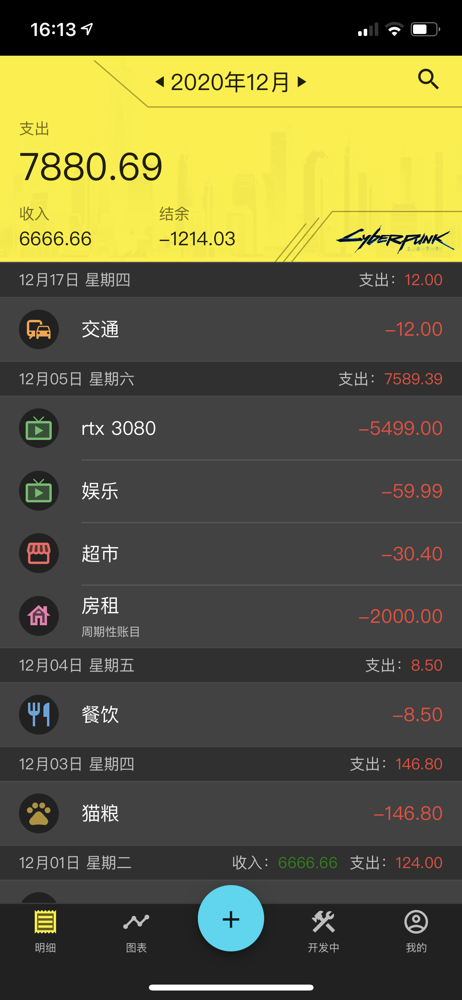
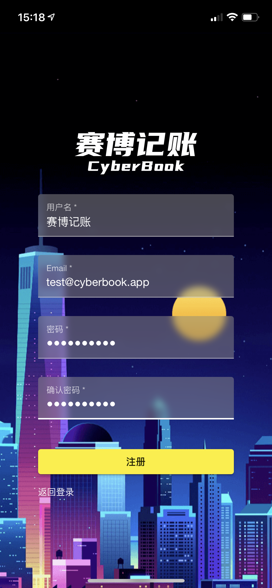

# 狼蛛记账 Spend Book

> 捉到狼蛛了！(绝对不可以模仿哦！!)

A mobile-first web app that can record daily costs.

# Screenshots

## Transactons

<table>
  <tr>
    <td>Transaction List</td>
     <td>Edit Transaction</td>
     <td>Add Transaction</td>
  </tr>
  <tr>
    <td></td>
    <td></td>
    <td></td>
  </tr>
 </table>

## Charts

<table>
  <tr>
    <td>Line Chart</td>
     <td>Pie Chart</td>
  </tr>
  <tr>
    <td></td>
    <td></td>
  </tr>
 </table>

## Category

<table>
  <tr>
    <td>Add Category</td>
    <td>Sort Category</td>
  </tr>
  <tr>
    <td></td>
    <td></td>
  </tr>
 </table>

## User Home

<table>
  <tr>
    <td>Account Overview</td>
    <td>Register</td>
    <td>Login</td>
  </tr>
  <tr>
    <td></td>
    <td></td>
    <td></td>
  </tr>
 </table>

## Other

<table>
  <tr>
    <td>Swipe to Delete Transaction</td>
    <td>Swipe to Delete Category</td>
    <td>Select Theme</td>
  </tr>
  <tr>
    <td></td>
    <td></td>
    <td></td>
  </tr>
 </table>

# Features

## Existing Features

- [x] Mobile first responsive
- [x] Add record
- [x] Edit record
- [x] Record category
- [x] Show month summary
- [x] Select month
- [x] Pie chart
- [x] Choose a month in pie chart
- [x] Line chart
- [x] Choose date range in line chart
- [x] Auto register temp user
- [x] Register the temp user account
- [x] Login with existing account
- [x] Swipe to delete a transaction/category
- [x] Theme, and dark theme
- [x] Add/Edit category
- [x] Drag to sort categories

## TODOs

- [ ] User profile image
- [ ] Category icon
- [ ] Search
- [ ] Offline editing
- [ ] Deploy
- [ ] UI design
- [ ] Theme color design
- [ ] Animation (WIP)

# How to run

1. Edit `http://192.168.50.17:3000` to `http://localhost:3000` in `src/environments/environment.ts`.
2. Run `npm install` and `npm install -g json-server`
3. Run `npm run mock-server` to start mock-server with `json-server`
4. Run `ng serve` in another terminal window, open `localhost:1234` in browser

If you want to see on a mobile device:

1. Run `npm install` and `npm install -g json-server` if you haven't done
2. Connect your computer and mobile device to the same router
3. Find the local network ip of your computer, usually something like `192.168.XX.XX`.
4. Edit `http://192.168.50.17:3000` to `http://{your computer local ip}:3000` in `src/environments/environment.ts`.
5. Run `json-server --host {your computer local ip} --watch mock-data/db.json`.
6. Run `ng serve --host {your computer local ip}` in another terminal window.
7. On your mobile device, open `http://{your computer local ip}:1234`. Note: at this time, on your computer, `localhost:1234` no longer works, you should also use `http://{your computer local ip}:1234` on your computer.

